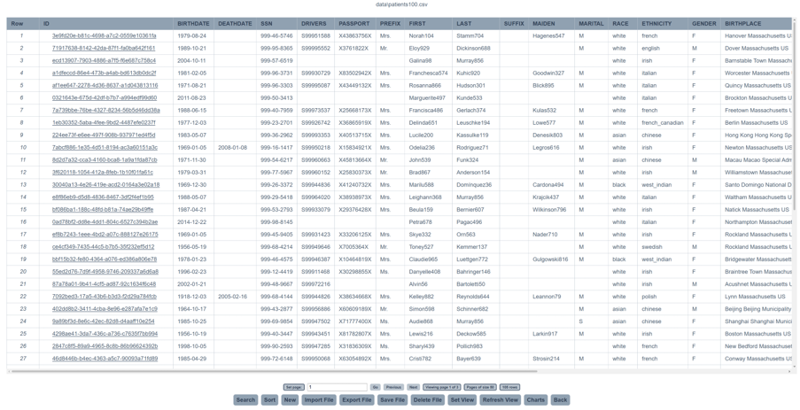

# Patient Data App

*A Java servlet/JSP web app for browsing, searching, editing and visualising
tabular hospital datasets (patients, encounters, medications, and more), built
on a from-scratch DataFrame/MVC stack - no database or web framework.*



## What this is

`Patient Data App` lets a user open a CSV or JSON dataset and interactively search, sort, page,
edit and chart it in the browser. It's built as a Maven web app: plain Java
servlets and JSPs on top of a small in-memory data-processing layer, with no
external database or front-end framework.

## What it does

The code in `src/main/java/uk/ac/ucl/` is split into three layers:

- **Model** (`model/`) - the data-processing core:
  - `Column` / `DataFrame` - a column stores one typed field across all rows;
    a `DataFrame` is a collection of columns loaded in full from a file.
  - `DataFrameView` - a filtered or reordered *reference* into a `DataFrame`
    (or into another `DataFrameView`), stored as row/column index lists
    rather than copied data. Search, sort, paging, and "set view" column
    selection are all just different views chained on top of one underlying
    `DataFrame`, so a hundred-thousand-row file is never duplicated in memory.
  - `SearchEngine` / `SortEngine` - produce a new view by filtering or
    reordering the row indices of an existing view; sorting auto-detects
    numeric vs. lexicographic comparison per column.
  - `PagedView` - slices a view into fixed-size pages for rendering.
  - `DataLoader` - parses CSV or JSON into a `DataFrame`, auto-detecting
    column types and candidate primary keys.
  - `ChartEngine` - buckets the rows of a view into chart-ready
    `{label: count}` maps: a pie chart for categorical fields (e.g.
    alive/dead), and histograms with automatically computed class widths for
    numeric fields (e.g. age, cost, birth year).
  - `Model` / `ModelFactory` - the interface the servlets talk to, wrapping
    the current `DataFrame`/view state for a session.
- **Servlets** (`servlets/`) - one servlet per user action (search, sort,
  new/edit/delete row, import/export file, set view, charts, save), all
  extending `BaseServlet` for shared forward/redirect/error-forward logic.
- **View** (`view/`, `webapp/*.jsp`) - `TableData` and `ChartRenderer` adapt
  model state into what the JSPs render; `TableExporter` writes the current
  view back out as CSV or JSON.

Features: search (any column or a specific one), sort (ascending/descending,
type-aware), add/edit/delete rows, pagination with row/page counts, column
selection via "Set View", import of any CSV/JSON file (with primary-key
detection), export to server-side files or as a download, and an
auto-generated charts dashboard for whichever dataset is currently loaded.

## Running it

Requires Java and Maven.

```
mvn clean package
mvn exec:exec
```

## Guide to the UI

| Operation | Details |
|---|---|
| Search | In the menu bar. Click the tag for the column to search (or "ANY"), type a keyword in the search bar that appears, press Go. The table updates to matching rows only. |
| Sort | Same as search, but pick ascending or descending order via a second set of tags. |
| New record | Click the button, fill in the form, and submit. The ID field must be filled and unique. |
| Edit record | Click a row's row number (or its primary-key hyperlink, if one was set on import) to open an edit page; submit with Update. |
| Delete record | Same as edit, but press Delete instead. |
| Import file | Choose a file from the list shown, then a primary key (or none) from the tags that appear. Works for CSV and JSON. |
| Export file | Choose CSV or JSON, then server-side or download, then a file name, then Go. |
| Save file | Click the button and confirm. |
| Delete file | Click the button and confirm. |
| Set View | Check the columns to display and set a new page size, then Go. |
| Refresh View | Click the button. |
| Charts | Opens a dashboard of auto-generated charts for the current view; Back returns to the table. |
| Paging | Enter a page number and Go, or use Next/Previous. |

## Project highlights

- **DataFrameView chaining** - because a view is just index references into
  a shared `DataFrame`, search -> sort -> set-view can be composed without
  copying data, and combining a search with the row-count tag effectively
  answers ad-hoc queries (e.g. "how many patients live in Cambridge?").
- **Pagination** keeps large tables (tested up to 100,000 rows) responsive
  by only ever rendering one page's worth of HTML at a time.
- **Type-aware sorting** - numeric columns sort numerically, everything else
  lexicographically, detected automatically per column.
- Charts are generated for whichever file is currently loaded, not just one
  hardcoded dataset - import a different file and the charts dashboard
  adapts to it.
- `BaseServlet` centralises forward/redirect/forward-to-error logic so the
  action servlets stay focused on their one job.
